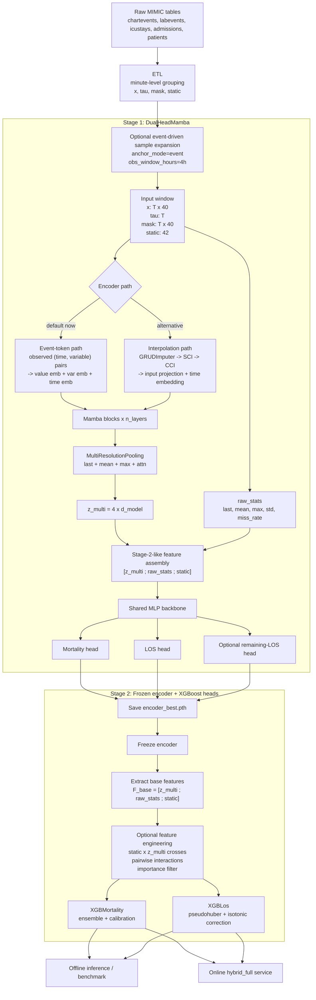

# MaBoost

Hybrid ICU risk modeling pipeline for irregular clinical time series.

This repository trains a frozen-sequence encoder plus XGBoost heads to predict:

- In-hospital mortality
- ICU length of stay (LOS)

The main code path is built around MIMIC-IV data in `data/raw/mimiciv`, with loader support for MIMIC-III-style filenames as well.

## What The Repo Actually Does

The current pipeline in [run_experiment.py](/home/milis/maboost/run_experiment.py) is:

1. Load raw ICU tables with Polars from CSV.gz files.
2. Build per-stay irregular sequences in [src/data/preprocess.py](/home/milis/maboost/src/data/preprocess.py).
3. Optionally expand each stay into multiple event-anchored samples with trailing observation windows using [src/data/temporal_samples.py](/home/milis/maboost/src/data/temporal_samples.py).
4. Train a `DualHeadMamba` model in Stage 1 to learn the encoder.
5. Freeze the encoder, extract features, and train XGBoost mortality and LOS heads in Stage 2.
6. Run ablations, offline benchmarks, plots, and SHAP explanations.
7. Optionally serve online predictions from a JSONL event stream with drift-aware XGBoost updates.

## MaBoost Architecture

MaBoost is a two-stage model, not a single end-to-end deployment graph.

```text
raw ICU tables
  -> ETL -> irregular windows: x, tau, mask, static
  -> Stage 1: DualHeadMamba
       encoder:
         path A (default in current config): event-token encoder
         path B (supported alternative): GRUDImputer -> SCI -> CCI
         -> Mamba blocks -> multi-resolution pooling -> z_multi
       stage1 heads:
         [z_multi ; raw_stats ; static] -> MLP backbone
         -> mortality logits
         -> LOS regression
         -> optional remaining-LOS head
  -> save encoder_best.pth
  -> Stage 2: frozen encoder + tree heads
       [z_multi ; raw_stats ; static]
       -> optional static x z_multi cross features
       -> optional pairwise interaction features
       -> XGBoost mortality ensemble + calibration
       -> XGBoost LOS regressor + isotonic correction
```

### Block Diagram



### Encoder Core

The main encoder class is [MambaEncoder](/home/milis/maboost/src/models/mamba_encoder.py). It always outputs:

- `z_multi`: pooled latent representation
- `raw_stats`: tabular summary block built from the same input window

`z_multi` is produced by `MultiResolutionPooling`, which concatenates:

- last-state pooling
- mean pooling
- max pooling
- attention pooling

So the latent width is always `4 * d_model`.

### Two Internal Encoder Paths

The encoder supports two different feature-extraction routes.

When `event_token_mode: true` in [config.yaml](/home/milis/maboost/config.yaml), the active path is:

- convert each observed `(timestamp, variable)` pair into a token
- embed measurement value, variable id, and time gap
- fuse those embeddings
- process the token sequence with Mamba blocks

When `event_token_mode: false`, the alternative path is:

- `GRUDImputer`: time-decayed imputation toward feature means
- `SCI`: interpolation to fixed reference points
- `CCI`: cross-channel interpolation
- input projection plus time embedding
- Mamba blocks over the interpolated reference sequence

This distinction matters because the repo contains both designs, but the current checked-in config enables the event-token branch by default.

### Stage 1 Model

Stage 1 trains [DualHeadMamba](/home/milis/maboost/src/models/mamba_encoder.py), which wraps the encoder with small neural heads.

An important implementation detail: Stage 1 does not train on a completely different representation from Stage 2. It explicitly assembles Stage-2-like features:

```text
[ z_multi ; raw_stats ; static ]
```

Then it applies:

- `LayerNorm`
- `Linear(head_in_dim -> 2 * d_model)`
- `GELU`
- `Dropout`
- `Linear(2 * d_model -> d_model)`
- `GELU`
- `Dropout`

From that shared backbone, Stage 1 predicts:

- mortality logits through `mort_head`
- LOS through `los_head`
- optional remaining LOS through `rem_los_head`

With the current default dimensions:

- `d_input = 40`
- `d_model = 128`
- `d_static = 42`
- `z_multi = 512`
- `raw_stats = 200`
- base Stage 1 / Stage 2 feature vector = `512 + 200 + 42 = 754`

### Stage 2 Model

Stage 2 is implemented in [src/training/stage2_train.py](/home/milis/maboost/src/training/stage2_train.py). It freezes the encoder and trains tree models on extracted features.

Base Stage 2 features:

```text
F_base = [ z_multi ; raw_stats ; static ]
```

Optional feature engineering then adds:

- static-by-latent cross features
- pairwise interaction features from top cover-ranked columns
- mortality-only low-importance feature dropping

The final heads are:

- `XGBMortality`: binary classifier, optional ensemble, optional isotonic calibration
- `XGBLos`: pseudohuber regressor on `log1p(LOS)`, optional isotonic post-correction

The exact transformed feature layout is exported in `checkpoints/stage2_meta.pkl` so offline and online inference can rebuild the same feature space.

### Deployment Variants

The repo contains three inference heads:

- `hybrid_full`: frozen MaBoost encoder plus Stage 2 transforms plus XGBoost heads
- `flat_head`: raw statistics plus static features only, no Mamba latent
- `distilled_head`: flat features plus teacher signals from the hybrid model

The main MaBoost architecture is `hybrid_full`.

## Pipeline Review

The codebase is internally consistent around an irregular-event workflow:

- ETL groups measurements by minute, keeps missing measurements as `NaN`, and computes `tau` as real inter-event time gaps.
- Dataset normalization only applies to observed values; missing positions remain distinguishable for the encoder and XGBoost.
- The encoder in [src/models/mamba_encoder.py](/home/milis/maboost/src/models/mamba_encoder.py) combines GRU-D-style imputation, interpolation modules, optional event-token mode, Mamba blocks, and multi-resolution pooling.
- Stage 2 in [src/training/stage2_train.py](/home/milis/maboost/src/training/stage2_train.py) trains on `[z_multi ; raw_stats ; static]` features, then applies optional static-cross features, interaction features, feature filtering, calibration, and mortality ensembling.
- Online inference in [src/inference/online_pipeline.py](/home/milis/maboost/src/inference/online_pipeline.py) rebuilds the same Stage 2 feature space and can update tree weights from labeled batches.

In short: this is not just a static benchmark script. It contains ETL, training, benchmarking, visualization, and an online inference/update path.

## Current Default Experiment

The checked-in [config.yaml](/home/milis/maboost/config.yaml) currently defaults to:

- `window_mode: fixed_48h`
- `seq_len: 64`
- `min_age: 65`
- `d_model: 128`
- `event_token_mode: true`
- `research.use_longitudinal_samples: true`
- `research.anchor_mode: event`
- `research.obs_window_hours: 4.0`
- `research.mortality_horizon_hours: 24.0`
- `research.los_target: remaining`
- `research.max_samples_per_stay: 4`
- `stage2.use_interaction_features: true`
- `stage2.use_static_cross: true`
- `stage2.n_ensemble_mort: 2`

That means the default run is not a single-sample-per-stay experiment. By default, it expands stays into multiple event-driven training samples before Stage 1 and Stage 2.

## Data Representation

ETL outputs:

- `sequences`: each stay/sample is `(seq, tau, mask, elapsed)`
- `static_features`: 42-dim static vector
- `mortality_labels`
- `los_labels`
- `stay_outcomes`

Important shapes in the current code:

- Time-series channels: 40
- Static features: 42
- Encoder pooled representation: `4 * d_model`
- Raw stats block: `5 * d_input`

Before Stage 2 feature engineering, the base feature vector is:

```text
[ z_multi (4 * d_model) ; raw_stats (5 * d_input) ; static (42) ]
```

## Key Entry Points

- [run.sh](/home/milis/maboost/run.sh): shell wrapper for ETL, training, and online mode
- [run_experiment.py](/home/milis/maboost/run_experiment.py): main offline pipeline
- [scripts/preflight_check.py](/home/milis/maboost/scripts/preflight_check.py): RAM/VRAM safety estimate
- [scripts/run_hospital_irregular_benchmark.py](/home/milis/maboost/scripts/run_hospital_irregular_benchmark.py): irregular hospital benchmark
- [src/inference/online_pipeline.py](/home/milis/maboost/src/inference/online_pipeline.py): hybrid online predictor
- [src/inference/flat_head_pipeline.py](/home/milis/maboost/src/inference/flat_head_pipeline.py): tree-only online predictor

## Repository Layout

```text
maboost/
├── config.yaml
├── run.sh
├── run_experiment.py
├── run_all.py
├── scripts/
│   ├── preflight_check.py
│   ├── run_hospital_irregular_benchmark.py
│   └── ...
├── src/
│   ├── data/
│   │   ├── loader.py
│   │   ├── preprocess.py
│   │   ├── dataset.py
│   │   └── temporal_samples.py
│   ├── models/
│   │   ├── mamba_encoder.py
│   │   ├── xgboost_head.py
│   │   └── baselines.py
│   ├── training/
│   │   ├── stage1_train.py
│   │   ├── stage2_train.py
│   │   └── baseline_trainer.py
│   ├── inference/
│   │   ├── offline_pipeline.py
│   │   ├── online_pipeline.py
│   │   └── flat_head_pipeline.py
│   └── visualization/
│       ├── training_plots.py
│       └── shap_explain.py
├── data/
│   ├── raw/
│   ├── processed/
│   └── splits/
├── checkpoints/
├── results/
└── summary/
```

## Environment

There is no lockfile or `requirements.txt` in this repo, so dependencies are inferred from the code and [run.sh](/home/milis/maboost/run.sh).

Core packages:

- `torch`
- `mamba-ssm`
- `polars`
- `xgboost`
- `scikit-learn`
- `numpy`
- `pyyaml`
- `shap`
- `river`
- `matplotlib`
- `tqdm`

Optional but used by some paths:

- `optuna`
- `psutil`

GPU is effectively required for the main training path as currently scripted.

## Data Layout

Place MIMIC-IV CSV.gz files in:

```text
data/raw/mimiciv/
```

The shell runner explicitly checks for these files:

- `chartevents.csv.gz`
- `icustays.csv.gz`
- `admissions.csv.gz`
- `patients.csv.gz`

Optional but supported by ETL:

- `labevents.csv.gz`
- `diagnoses_icd.csv.gz`

## Common Commands

Run a preflight memory check:

```bash
python scripts/preflight_check.py --config config.yaml
```

Run the full offline pipeline:

```bash
./run.sh
```

Reuse cached ETL:

```bash
./run.sh --skip-etl
```

Run ETL only:

```bash
./run.sh --etl-only
```

Run directly without the shell wrapper:

```bash
python run_experiment.py --config config.yaml
```

Skip SHAP to reduce RAM/time:

```bash
python run_experiment.py --config config.yaml --skip-shap
```

Force the windowing mode:

```bash
./run.sh --fixed_48h
./run.sh --expanding_window
```

Run the hospital irregular benchmark:

```bash
python scripts/run_hospital_irregular_benchmark.py --config config.yaml --skip-etl
```

Start the online service:

```bash
./run.sh --online-service
```

## Online Event Format

`online_service` tails a JSONL file. The main event types are:

Observation event:

```json
{"type":"observation","stay_id":"12345","x_new":[...],"tau_new":300.0,"x_static":[...]}
```

Label event:

```json
{"type":"label","stay_id":"12345","y_mort":0,"y_los":3.25}
```

Discharge event:

```json
{"type":"discharge","stay_id":"12345"}
```

## Outputs

Important training artifacts:

- `checkpoints/encoder_best.pth`
- `checkpoints/xgb_mortality.ubj`
- `checkpoints/xgb_los.ubj`
- `checkpoints/mort_meta.pkl`
- `checkpoints/los_meta.pkl`
- `checkpoints/stage2_meta.pkl`
- `checkpoints/flat_head_*`
- `checkpoints/distilled_head_*`
- `checkpoints/norm_stats.pkl`

Important result files:

- `results/benchmark.csv`
- `results/benchmark_temporal.csv`
- `results/benchmark_temporal_irregular.csv`
- `results/benchmark_hospital_irregular_fair.csv`
- `results/head_ablation.csv`
- `results/model_params.json`
- `results/pipeline_progress.json`
- `results/mortality/*.png`
- `results/los/*.png`
- `results/shap/*.png`

## Notes

- [run.sh](/home/milis/maboost/run.sh) is wired around CUDA and MIMIC-IV paths.
- Loader code in [src/data/loader.py](/home/milis/maboost/src/data/loader.py) is more flexible than the shell wrapper and can normalize MIMIC-III-style naming.
- The repository already contains checkpoints and result artifacts, so a fresh run is not required just to inspect outputs.
- If Stage 2 uses transformed features, `stage2_meta.pkl` is required for online inference parity.

## Suggested Reading Order

If you want to understand the code quickly, start here:

1. [config.yaml](/home/milis/maboost/config.yaml)
2. [run_experiment.py](/home/milis/maboost/run_experiment.py)
3. [src/data/preprocess.py](/home/milis/maboost/src/data/preprocess.py)
4. [src/models/mamba_encoder.py](/home/milis/maboost/src/models/mamba_encoder.py)
5. [src/training/stage2_train.py](/home/milis/maboost/src/training/stage2_train.py)
6. [src/inference/offline_pipeline.py](/home/milis/maboost/src/inference/offline_pipeline.py)
7. [src/inference/online_pipeline.py](/home/milis/maboost/src/inference/online_pipeline.py)
